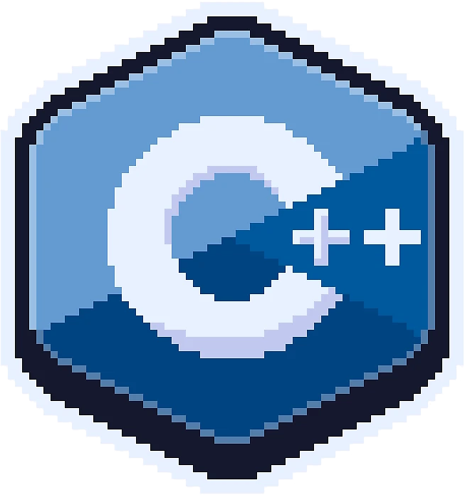
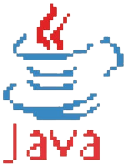

  
  
  
  

# Olá!
Meu nome é Victor. Sou um estudante de Análise e Desenvolvimento de Sistemas (IFPB, Cajazeiras). Gosto de matemática e atualmente estou me preparando para a Maratona SBC. Se quiser saber mais sobre o que eu faço com uma demonstração interativa dê uma olhada nesses [projetos](https://victorivis.github.io/portifolio/).

# Contato
ivis.rolim@gmail.com

# Estatísticas

 
 

